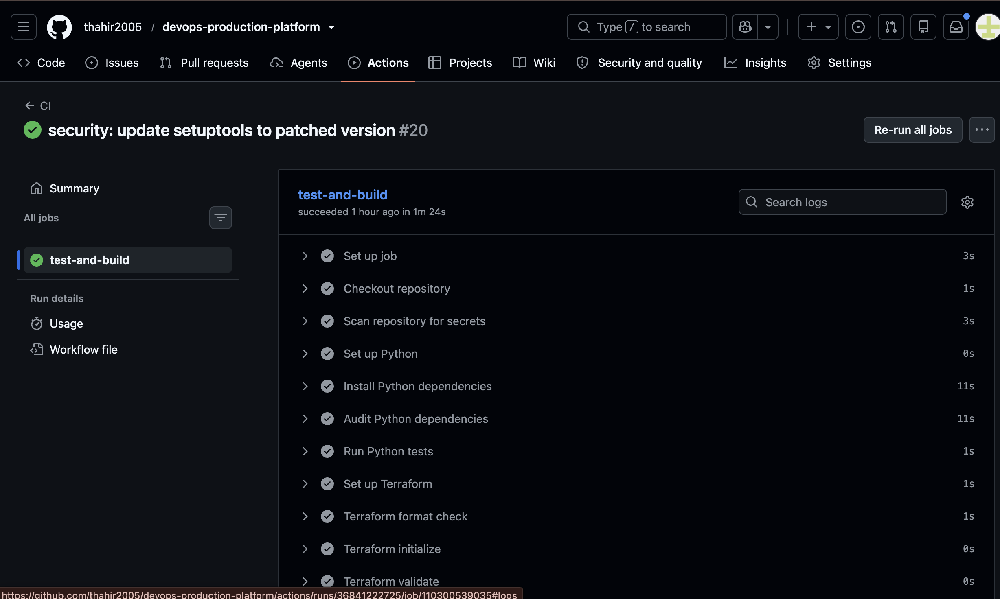
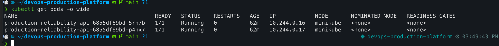
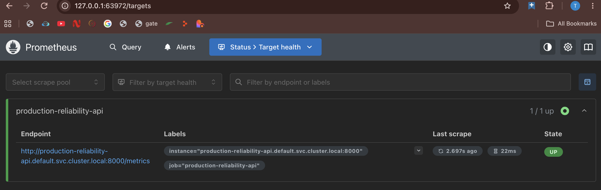
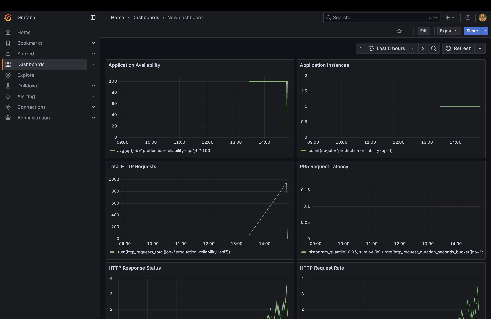

# Production Reliability Platform

A production-style DevOps and DevSecOps platform demonstrating automated CI/CD, containerization, Kubernetes deployment, infrastructure validation, security scanning, and application observability.

## Architecture

    Developer

        |

        v

      GitHub

        |

        v

    GitHub Actions

        |

        +-- Python Tests

        +-- Terraform Validation

        +-- Kubernetes Validation

        +-- Gitleaks Secret Scan

        +-- pip-audit Dependency Scan

        +-- Docker Build

        +-- Trivy Container Scan

        |

        v

    GitHub Container Registry

        |

        v

    Kubernetes / Minikube

        |

        +-- Replica 1

        +-- Replica 2

        |

        v

    Prometheus

        |

        v

      Grafana

## Key Features

- FastAPI production-style application

- Docker containerization

- GitHub Container Registry

- Kubernetes deployment with 2 replicas

- Readiness and liveness probes

- Kubernetes self-healing

- CPU and memory resource requests and limits

- Terraform infrastructure configuration

- GitHub Actions CI/CD

- Kubernetes manifest validation with Kubeconform

- Gitleaks secret scanning

- pip-audit Python dependency scanning

- Trivy container vulnerability scanning

- Prometheus metrics collection

- Grafana monitoring dashboard

- Persistent Grafana storage

## Tech Stack

| Category | Technology |

|---|---|

| Application | Python, FastAPI |

| Testing | Pytest |

| Containerization | Docker |

| Orchestration | Kubernetes, Minikube |

| CI/CD | GitHub Actions |

| Registry | GitHub Container Registry |

| Infrastructure | Terraform |

| Security | Gitleaks, pip-audit, Trivy |

| Monitoring | Prometheus, Grafana |

| Validation | Kubeconform |

| Version Control | Git, GitHub |

## Project Structure

    devops-production-platform/

    ├── app/

    │   └── main.py

    ├── infrastructure/

    │   ├── kubernetes/

    │   │   ├── deployment.yaml

    │   │   └── service.yaml

    │   ├── monitoring/

    │   │   ├── grafana-deployment.yaml

    │   │   ├── grafana-pvc.yaml

    │   │   ├── grafana-service.yaml

    │   │   ├── prometheus-config.yaml

    │   │   ├── prometheus-deployment.yaml

    │   │   └── prometheus-service.yaml

    │   └── terraform/

    │       ├── main.tf

    │       ├── variables.tf

    │       ├── outputs.tf

    │       └── versions.tf

    ├── .github/

    │   └── workflows/

    │       └── ci.yml

    ├── Dockerfile

    ├── requirements.txt

    ├── .gitignore

    └── README.md

## Application

The application is built with FastAPI and exposes the following endpoints:

| Endpoint | Purpose |

|---|---|

| `/` | Application information |

| `/health` | Health check |

| `/api/info` | Application metadata |

| `/metrics` | Prometheus metrics |

## Local Development

Create a virtual environment:

    python3 -m venv .venv

Activate it:

    source .venv/bin/activate

Install dependencies:

    pip install -r requirements.txt

Run tests:

    pytest

Run the application:

    uvicorn app.main:app --reload

The application runs on `http://localhost:8000`.

## Docker

Build the application image:

    docker build -t production-reliability-api:latest .

Run the container:

    docker run --rm -p 8000:8000 production-reliability-api:latest

Verify the health endpoint:

    curl http://localhost:8000/health

## Kubernetes Deployment

The application is deployed to Kubernetes using a Deployment and Service.

Key Kubernetes features include:

- 2 application replicas

- Readiness probe

- Liveness probe

- CPU and memory requests

- CPU and memory limits

- Kubernetes self-healing

- NodePort service exposure

Deploy the application:

    kubectl apply -f infrastructure/kubernetes/

Verify the deployment:

    kubectl get deployments

    kubectl get pods

    kubectl get services

Test Kubernetes self-healing:

    kubectl delete pod -l app=production-reliability-api

Kubernetes automatically recreates the deleted pods to maintain the desired replica count.

## Infrastructure Validation

Terraform is used to manage deployment metadata and demonstrate infrastructure-as-code practices.

Validate Terraform configuration:

    cd infrastructure/terraform

    terraform fmt -check

    terraform init

    terraform validate

    terraform plan

## CI/CD Pipeline

GitHub Actions automatically validates every push and pull request targeting the main branch.

The pipeline performs:

1. Repository secret scanning with Gitleaks

2. Python dependency installation

3. Python test execution with Pytest

4. Terraform format validation

5. Terraform initialization and validation

6. Kubernetes manifest validation with Kubeconform

7. Monitoring manifest validation

8. Docker image build

9. Container vulnerability scanning with Trivy

10. Python dependency vulnerability scanning with pip-audit

11. Docker image publishing to GitHub Container Registry

Images are tagged using the Git commit SHA for traceability.

## Security

Security is integrated into the CI/CD pipeline rather than treated as a separate manual step.

### Gitleaks

Scans the repository for accidentally committed secrets.

### Trivy

Scans the container image for HIGH and CRITICAL operating-system vulnerabilities.

### pip-audit

Checks Python dependencies against known vulnerability databases.

The current dependency set passes pip-audit with no known vulnerabilities.

## Monitoring

The application exposes Prometheus-compatible metrics through `/metrics`.

Prometheus scrapes the application every 15 seconds.

Grafana is configured with Prometheus as its data source and provides dashboards for:

- HTTP request rate

- HTTP response status

- P95 request latency

- Total HTTP requests

- Application instances

- Application availability

Grafana data is stored using a persistent Kubernetes volume.

## Reliability Demonstration

The project demonstrates Kubernetes self-healing by running two application replicas.

When application pods are manually deleted, Kubernetes automatically creates replacement pods to restore the desired state.

The application also uses readiness and liveness probes to allow Kubernetes to determine whether the service is ready to receive traffic and whether the container remains healthy.

## Screenshots

### CI/CD Pipeline

### Kubernetes Deployment

### Prometheus Target Health

### Grafana Monitoring Dashboard

## Project Highlights

This project demonstrates an end-to-end DevOps workflow covering:

- Application development

- Automated testing

- Containerization

- Infrastructure as Code

- Kubernetes orchestration

- CI/CD automation

- Container registry integration

- Security scanning

- Dependency security

- Application monitoring

- Metrics collection

- Dashboarding

- Kubernetes self-healing

- Persistent monitoring storage

## Author

**Thahir**

B.Tech Computer Science and Information Technology

SRKR Engineering College

